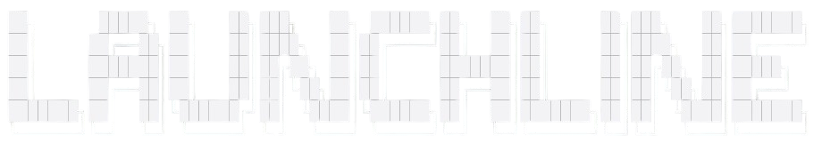

<div align="left">



</div>

**One command. Your entire workspace.**

Launchline is an offline-first, cross-platform terminal utility for starting the applications you use together. It discovers the applications already installed on your computer, lets you group them into named workspaces, and launches the whole group from an interactive command session or one shell command.

```console
launchline start development
```

Launchline is local, keyboard-first, account-free, and intentionally small. It has no server, telemetry, cloud synchronization, or application installer.

## Features

- Slash-command-first Bubble Tea session with responsive Launchline branding
- Local installed-application discovery with a fast cached catalog
- Application search, command completion, and in-memory command history
- Application add, edit, inspect, and confirmed removal flows
- Workspace create, rename, application selection, default selection, and confirmed deletion
- Concurrent launches with independent per-application results
- Direct commands suitable for scripts and terminal workflows
- Atomic, validated local JSON configuration with safety copies for corrupt files
- Native launch strategies for Windows, Linux, and macOS
- Useful empty states, contextual help, and keyboard controls

## Supported platforms

Launchline builds for Windows, Linux, and macOS on amd64 and arm64. Discovery uses normal, bounded operating-system sources rather than crawling entire disks:

- Linux: XDG user/system desktop-entry directories, including configured `XDG_DATA_HOME` and `XDG_DATA_DIRS`, plus common Flatpak and Snap desktop export locations when present. Hidden, non-display, terminal-only, and invalid entries are filtered; desktop `Exec` placeholders are removed and arguments remain structured.
- Windows: per-user and system Start Menu shortcuts plus registered App Paths. Launchline does not recursively scan the system drive.
- macOS: `.app` bundles in `/Applications`, `~/Applications`, and `/System/Applications`, using bundle display metadata when available.

Discovery is intentionally practical rather than exhaustive. Manual registration remains available for custom binaries and non-standard installations. Launchline starts executables directly and uses safe platform openers for application bundles, shortcuts, desktop targets, and URLs where appropriate.

## Install or build

Download a binary from the [latest published release](https://github.com/clarkkkkkkk/launchline-terminal/releases/latest). Linux binaries are available for [x64 / AMD64](https://github.com/clarkkkkkkk/launchline-terminal/releases/latest/download/launchline_linux_amd64) and [ARM64](https://github.com/clarkkkkkkk/launchline-terminal/releases/latest/download/launchline_linux_arm64). Choose the architecture reported by `uname -m`: `x86_64` uses AMD64; `aarch64` uses ARM64. Draft releases are not publicly downloadable.

For Linux x64, download and install without sudo:

```console
curl -fL https://github.com/clarkkkkkkk/launchline-terminal/releases/latest/download/launchline_linux_amd64 -o launchline_linux_amd64
mkdir -p ~/.local/bin
install -m 755 launchline_linux_amd64 ~/.local/bin/launchline
export PATH="$HOME/.local/bin:$PATH"
launchline version
```

Stop if the download reports an HTTP or network error; do not install its output. For ARM64, replace `amd64` with `arm64`.

Launchline requires Go 1.24 or newer to build from source.

```console
git clone https://github.com/clarkkkkkkk/launchline-terminal.git
cd launchline-terminal
go build -o launchline .
```

Move the resulting binary to a directory on your `PATH`. Tagged releases are prepared by the release workflow as standalone binaries; no Go runtime is required to use a release binary.

## Quick start

Open the interactive command session. Launchline renders its cached catalog immediately and refreshes it in the background:

```console
launchline
```

Inside Launchline, start with:

```text
> /applications
> /workspaces
> /start
```

Or configure Launchline directly with the traditional shell commands:

```console
launchline add --name Cursor --path /usr/bin/cursor
launchline add --name Terminal --path /usr/bin/kitty
launchline workspace create --name Development --app Cursor --app Terminal --default
launchline start
```

Paths vary by operating system. Arguments are repeatable structured values:

```console
launchline add --name Chrome --path /path/to/chrome \
  --arg=--profile-directory --arg="Profile 1"
```

Launchline passes those values directly to the process API. It does not evaluate shell syntax.

Manual applications also support an optional working directory:

```console
launchline add --name "Cursor Project" --path /usr/bin/cursor \
  --arg=. --arg=--classic --working-directory=/home/clark/projects/launchline
launchline apps edit "Cursor Project" --arg=--profile --arg="Work Profile"
launchline apps edit "Cursor Project" --clear-args --working-directory=""
```

In the TUI, use **A** to add or **E** to edit a manual application. Enter arguments as a line such as `. --classic` or `--profile "Work Profile"`; single and double quotes group values, and `""` supplies an empty argument. Backslashes escape quotes, whitespace, and other backslashes outside quotes, or double quotes and backslashes inside double quotes. Single-quoted values preserve backslashes literally. No variables, substitutions, or shell operators are evaluated. Clearing the Arguments field removes all arguments. The CLI accepts each repeated `--arg` value literally; `--arg=` passes one empty argument, while `--clear-args` removes all arguments and cannot be combined with `--arg`.

Working directories apply to direct executables on Windows, Linux, and macOS. Leave the field empty for Launchline's normal current-directory behavior. Relative working directories and relative executable paths resolve against Launchline's current directory; neither `~` nor environment variables are expanded by Launchline. A missing or invalid directory fails that application's launch with a diagnostic while other workspace applications continue. Directory existence is checked when launching, so temporarily unavailable folders do not prevent configuration from loading.

Platform openers cannot reliably set the application's working directory: macOS `.app` bundles, Windows shortcuts, and desktop-file or URL targets reject this option. Register the direct executable to use it. macOS bundles retain argument forwarding through `open --args`; existing argument restrictions for Windows shortcuts/URLs and Linux desktop-file/URL targets remain. Applications that reuse an already-running instance may handle arguments according to their own behavior.

Application details display arguments and the working directory, or **None** and **Default** when unset. Discovered entries remain managed by discovery, including any existing desktop-entry arguments. Use `/add` with a distinct name to create a manual variant for custom settings. Settings belong to the application and apply in every workspace that references it.

Configuration continues to store `path` and an `arguments` array, with an optional `working_directory` string. Existing version-1 and version-2 configurations load without these fields; application IDs and workspace membership remain intact. Older Launchline binaries that reject unknown JSON fields cannot read entries containing `working_directory` until that field is removed.

## Stop a workspace

Use `launchline stop Development` in your terminal, or `/stop Development` inside Launchline. Omit the name to use the default workspace. Save your work before stopping: Linux and macOS send SIGTERM, whose handling is application-specific; Windows sends WM_CLOSE so applications can show save dialogs. Launchline never escalates to a force kill. A successful result means a close request was sent, not that the application has exited.

Only direct processes started through Launchline's workspace launcher are tracked. Local process records live in a `running` directory beside `config.json`, survive Launchline restarts, and are checked against OS process start identity before use. Stale records are removed without signaling a reused PID. Each launch belongs to its workspace; manually opened instances and processes launched from other workspaces are left alone.

Platform openers (macOS bundles, Windows shortcuts, desktop files, and URLs), detached descendants, and applications that reuse an existing instance cannot be safely attributed by this mechanism. They remain open and may report “no tracked process running.” Register a direct executable when possible. Windows processes without a top-level window must be closed manually. Linux stop requires kernel 5.3 or newer for PID handles. Apps launched by older Launchline versions have no process records and are also left alone. These limits preserve existing launch behavior without guessing ownership by application name.

## Commands

```text
launchline                         Open the interactive dashboard
launchline start                   Start the default workspace
launchline start <workspace>       Start a workspace by name or ID
launchline stop [workspace]        Request closure of tracked workspace processes
launchline add [flags]             Register an application
launchline apps                    List applications
launchline refresh                 Refresh installed-application discovery
launchline apps edit <app>         Edit an application
launchline apps delete <app>       Remove an entry with --yes
launchline workspace               List workspaces
launchline workspace create        Create a workspace
launchline workspace edit          Rename or replace its app selection
launchline workspace default       Choose the default workspace
launchline workspace delete        Delete a workspace with --yes
launchline config                  Show local configuration information
launchline config path             Print the configuration path
launchline version                 Show build version metadata
launchline help                    Show command help
```

Run `launchline <command> --help` for flags and examples.

## Interactive commands

The root screen preserves Launchline's responsive wordmark and default-workspace summary, then gives focus to a real Launchline-only `>` prompt. It does not execute shell commands.

| Command | Action |
| --- | --- |
| `/start [workspace]` | Start the default or named workspace |
| `/stop [workspace]` | Request closure of processes started in that workspace |
| `/applications`, `/apps` | Browse and search discovered applications |
| `/workspaces` | Manage workspaces |
| `/workspace <name>` | Open a workspace; quoted names are supported |
| `/add` | Register a custom application manually |
| `/refresh` | Refresh the local application catalog asynchronously |
| `/settings` | Open settings |
| `/help`, `?` | Show interactive command help |
| `/version` | Show the current version |
| `/clear` | Clear session messages |
| `/exit` | Exit cleanly |

Tab completes commands and matching workspace names. Up and Down navigate command history while the root prompt owns focus; history exists only for the current session. Unknown commands offer a close suggestion where possible.

Interactive lists and forms remain available where they are more useful than text output. The Applications screen filters the cached catalog as you type. Workspace creation and editing select discovered and manual apps with checkboxes. A selected discovered app receives a stable configuration link; the rest of the catalog remains separate.

The main controls in interactive screens are:

| Key | Action |
| --- | --- |
| Up / Down | Navigate |
| Left / Right | Change an option or form stage |
| Enter | Open, continue, or save |
| Space | Toggle an application in a workspace |
| Esc | Cancel or go back |
| `?` | Contextual help |

The Applications screen also keeps manual add/edit/removal as a fallback. The Workspaces screen creates groups, selects applications with checkboxes, and chooses exactly one default. Removal affects Launchline configuration only—it never uninstalls applications.

## Configuration

Launchline stores `config.json` and a separate `catalog.json` under the operating system's user configuration directory, in a `launchline` folder. Typical configuration locations are:

- Windows: `%AppData%\launchline\config.json`
- Linux: `$XDG_CONFIG_HOME/launchline/config.json`, usually `~/.config/launchline/config.json`
- macOS: `~/Library/Application Support/launchline/config.json`

Use `launchline config path` for the exact path on your computer.

`config.json` contains user choices, manual apps, and stable links for discovered apps selected into workspaces. `catalog.json` is a rebuildable cache of machine discovery results. Both use same-directory temporary files and atomic replacement where the operating system permits. The configuration schema is versioned; v0.1 data migrates additively with IDs, default workspace, membership, paths, arguments, and preferences preserved. A malformed file receives a timestamped `.corrupt-*` safety copy instead of being silently overwritten.

If an app selected in a workspace is no longer discovered, Launchline marks it unavailable rather than deleting it or its workspace reference. A partial source failure retains cached entries and reports a non-fatal warning.

## Architecture

```text
Cobra CLI ─┐
           ├─> application services ─> launcher interface ─> OS process behavior
Bubble TUI ┘             │
                         └─> validated JSON repository

OS discovery ─> normalized catalog ─> workspace/application selection
```

The CLI and TUI share all CRUD, discovery, resolution, and launch services. Discovery and launching remain separate: platform scanners only produce normalized targets, while `internal/launcher` owns process behavior. The TUI never executes operating-system commands. Stable application IDs keep workspace references intact when names or paths change.

## Development

```console
go mod download
gofmt -w .
go test ./...
go vet ./...
go build ./...
```

CI runs formatting, tests, vet, and builds on Ubuntu, Windows, and macOS. Tests use fakes and temporary configuration directories; they never start real desktop applications.

See [CONTRIBUTING.md](CONTRIBUTING.md) and the Launchline design contract in [.agents/skills/launchline-design/SKILL.md](.agents/skills/launchline-design/SKILL.md).

## Security behavior

Launchline treats discovered and manual targets and arguments as process arguments, not shell source. Linux desktop placeholders are normalized rather than passed through blindly. The interactive prompt recognizes only its internal command registry. Launchline does not concatenate commands, execute hooks, install programs, or accept arbitrary scripts.

Discovery happens entirely on the local computer. Installed-application names and metadata are never sent over the network; Launchline has no analytics, telemetry, accounts, cloud sync, or crash-reporting service.

## v0.2.0 status

This repository implements the usability-focused v0.2.0 direction: cached cross-platform application discovery, discovered-app workspace selection, a slash-command interactive session, manual fallback registration, direct Cobra workflows, local persistence, and cross-platform launching.

No discovery strategy can identify every custom installation. Import/export and additional package-manager distribution remain possible future work. Accounts, cloud sync, remote launching, telemetry, and arbitrary scripting remain outside the product scope.

No license has been selected yet. Choose one before public distribution.
